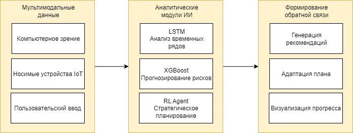

**УДК 004.891.3**

**ИНТЕЛЛЕКТУАЛЬНЫЕ СИСТЕМЫ АДАПТИВНОГО УПРАВЛЕНИЯ ТРЕНИРОВОЧНЫМ
ПРОЦЕССОМ НА ОСНОВЕ МЕТОДОВ МАШИННОГО ОБУЧЕНИЯ И АНАЛИЗА МУЛЬТИМОДАЛЬНЫХ
ДАННЫХ**

Королёв М.С. -- к.т.н., доцент кафедры «Прикладные информационные
технологии»,

Захарчук С.И. -- студент кафедры «Прикладные информационные технологии»,

Ларионов К.А. -- студент кафедры «Прикладные информационные технологии»,

Юнева Е.П. -- студент кафедры «Прикладные информационные технологии»,

Саратовский государственный технический университет Гагарина Ю.А.

Россия, г. Саратов

**Аннотация.** В работе представлена архитектура интеллектуальной
системы адаптивного управления тренировочным процессом, основанная на
интеграции мультимодальных данных и современных методах машинного
обучения. Рассматриваются блоки сбора данных (компьютерное зрение,
носимые устройства, пользовательский ввод), анализа и прогнозирования
(LSTM, ансамбли деревьев, обучение с подкреплением) и принятия решений.
Проведен сравнительный анализ эффективности методов, показавший
преимущество гибридного подхода, который позволяет создавать
персонализированные, безопасные и эффективные фитнес-решения.

**Ключевые слова:** искусственный интеллект, машинное обучение,
адаптивные тренировки, компьютерное зрение, обучение с подкреплением,
мультимодальные данные, фитнес.

**INTELLIGENT ADAPTIVE TRAINING PROCESS MANAGEMENT SYSTEMS BASED ON
MACHINE LEARNING METHODS AND MULTIMODAL DATA ANALYSIS**

M. Korolev -- Candidate of Technical Sciences, Associate Professor of
the Department of Applied Information Technologies,

S. Zakharchuk -- student of the Department of Applied Information
Technologies,

K. Larionov -- student of the cafe of the Department of Applied
Information Technologies,

E. Yuneva -- student of the Department of Applied Information
Technologies,

Saratov State Technical University of Gagarin Yu. A.

Russia, Saratov

**Annotation.** The paper presents the architecture of an intelligent
adaptive training process management system based on the integration of
multimodal data and modern machine learning methods. The blocks of data
collection (computer vision, wearable devices, user input), analysis and
forecasting (LSTM, ensembles of trees, reinforcement learning) and
decision-making are considered. A comparative analysis of the
effectiveness of the methods was carried out, which showed the advantage
of a hybrid approach that allows you to create personalized, safe and
effective fitness solutions.

**Keywords:** artificial intelligence, machine learning, adaptive
training, computer vision, reinforcement learning, multimodal data,
fitness.

Современная фитнес-индустрия и спортивный тренинг столкнулись с
системной проблемой: противоречием между стандартизированными
тренировочными программами и уникальными физиологическими,
анатомическими и психологическими характеристиками каждого человека.
Традиционные подходы, основанные на усредненных шаблонах \"один размер
для всех\", не учитывают текущее функциональное состояние организма,
динамику восстановления и индивидуальные биомеханические особенности,
что неизбежно приводит к снижению эффективности, отсутствию устойчивого
прогресса и повышенному риску травматизма \[1\].

Бурное развитие технологий искусственного интеллекта (ИИ), массовое
распространение носимых устройств (IoT) и повышение вычислительной
мощности мобильных процессоров создали предпосылки для перехода от
пассивного мониторинга активности к созданию интеллектуальных активных
систем -- так называемых \"AI-тренеров\". Эти системы способны в
реальном времени анализировать комплексное состояние пользователя,
объективно оценивать технику выполнения упражнений и динамически
адаптировать тренировочный план для достижения максимальных результатов
при минимизации рисков \[2\].

Целью данной работы является проектирование архитектуры интеллектуальной
системы адаптивного управления тренировочным процессом и анализ
эффективности современных методов машинного обучения (МО) для реализации
ее ключевых компонентов. В основе предлагаемого решения лежит
комплексный мультимодальный подход к сбору и обработке данных,
позволяющий преодолеть ограничения стандартизированных методик.

Предлагаемая система представляет собой трехуровневую архитектуру,
состоящую из взаимосвязанных модулей: сбора мультимодальных данных, их
анализа и прогнозирования, а также принятия решений и обратной связи.
Интеграция разнородных данных и их синергетическая обработка являются
залогом успешной персонализации.

Рисунок 1 -- Общая архитектура интеллектуальной системы адаптивного
управления тренировочным процессом

Фундаментом системы является мультимодальный сбор данных, позволяющий
сформировать целостную цифровую модель состояния пользователя, который
включает в себя компьютерное зрения для биомеханического анализа, данные
с носимых устройств (IoT) и субъективный пользовательский ввод.

Для объективной оценки техники выполнения упражнений используется анализ
видеопотока с камеры смартфона. Ключевыми технологиями являются: Pose
Estimation (оценка позы) и Сверточные нейронные сети (CNN).

Для оценки позы применяются современные библиотеки MediaPipe Pose и
OpenPose, которые в реальном времени с высокой точностью определяют
пространственное положение ключевых точек скелета (суставы, центры масс)
\[3\].

Сверточные нейронные сети (CNN) используются для классификации
упражнений и выявления паттернов, ассоциированных с ошибками. Например,
CNN может быть обучена распознавать такие опасные паттерны, как:
округление грудного отдела позвоночника в становой тяге, вальгусное
положение коленей при приседаниях, недостаточная амплитуда движения.

На выходе данного модуля формируются количественные метрики: углы в
суставах, траектории движения, симметрия, которые используются для
оценки корректности техники и расчета риска травмы.

Интеграция с фитнес-браслетами, умными часами и другими датчиками
предоставляет непрерывный поток объективных физиологических данных:

Частота сердечных сокращений (ЧСС) и вариабельность сердечного ритма
(HRV): являются ключевыми индикаторами вегетативного статуса и уровня
стресса организма. Снижение HRV часто коррелирует с состоянием
недовосстановления. Помимо них также можно отслеживать уровень кислорода
в крови (SpO2) и активность и фазы сна.

Эти данные, представляющие собой многомерные временные ряды, являются
основой для прогнозирования уровня усталости и готовности к
высокоинтенсивным нагрузкам.

Для учета психоэмоционального состояния, которое слабо отражается в
объективных метриках, система запрашивает у пользователя через мобильное
приложение субъективные оценки по шкалам (например, от 1 до 10): общее
самочувствие, качество и продолжительность сна, уровень стресса и
мотивации.

Хотя эти данные субъективны, они критически важны для тонкой
корректировки плана, так как напрямую влияют на производительность и
риск возникновения состояния перетренированности.

Собранные мультимодальные данные поступают в аналитический модуль, где
для их обработки применяется комбинация специализированных методов МО,
каждый из которых решает свою задачу.

Для обработки данных с носимых устройств наиболее эффективны
рекуррентные нейронные сети с долгой краткосрочной памятью (LSTM - Long
Short-Term Memory). LSTM специально разработаны для работы с временными
последовательностями и способны улавливать долгосрочные зависимости
\[4\]. Модель LSTM может быть обучена решать следующие задачи:

1.  Прогнозирование уровня усталости: на основе динамики ЧСС и HRV за

    > последние 3-7 дней модель предскажет уровень утомления на текущий
    > день.

2.  Раннее выявление перетренированности: как задача бинарной

    > классификации на основе совокупности физиологических показателей и
    > их динамики.

3.  Оценка готовности к нагрузке: прогноз максимальной
    > производительности (например, в рамках теста 1ПМ - одного
    > повторного максимума) на предстоящей тренировке.

Для работы с табличными данными (антропометрия, история тренировок и
предыдущих травм, статические показатели) наивысшую эффективность
демонстрируют ансамбли деревьев решений, в частности алгоритмы
градиентного бустинга XGBoost (eXtreme Gradient Boosting) и LightGBM
(Light Gradient Boosting Machine) \[5\]. Эти методы обладают рядом
преимуществ: способность обрабатывать разнородные данные (числовые,
категориальные), высокая устойчивость к выбросам и шуму в данных,
показывают state-of-the-art результаты в задачах бинарной классификации
(\"риск травмы есть/нет\") и регрессии (оценка уровня риска от 0 до 1).

Модель, обученная на исторических данных, оценивает вероятность
возникновения травмы опорно-двигательного аппарата на основе текущей
нагрузки, выявленных ошибок техники (от компьютерного зрения) и
состояния восстановления.

Сложной задачей является долгосрочное планирование тренировочного
процесса. Для ее решения предлагается использовать обучение с
подкреплением. В данной парадигме система рассматривается как агент,
взаимодействующий со средой (пользователем):

1.  Состояние (State, S): Вектор, описывающий текущее состояние

    > пользователя: физиологические показатели, результаты последней
    > тренировки, оценка техники, субъективные оценки, уровень риска
    > травмы.

2.  Действие (Action, A): Коррекция тренировочных параметров: изменение

    > веса снарядов, количества подходов/повторений, интенсивности, типа
    > упражнений, продолжительности отдыха.

3.  Вознаграждение (Reward, R): Скалярная функция, которая увеличивается
    > при достижении целей (рост силовых показателей, улучшение
    > телосложения, положительная динамика) и уменьшается при негативных
    > исходах (отсутствие прогресса, признаки перетренированности,
    > ошибки в технике, приводящие к высокой оценке риска травмы).

Агент (RL-модель) методом проб и ошибок учится выбирать такие
последовательности действий, которые максимизируют совокупное
вознаграждение в долгосрочной перспективе. Таким образом, система не
просто следует жестко заложенным правилам (\"экспертным системам\"), а
самостоятельно вырабатывает оптимальную, высоко персонализированную
стратегию для каждого пользователя.

На основе интеграции выводов всех аналитических модулей система
формирует конкретные, интерпретируемые рекомендации для пользователя в
реальном времени:

1.  Коррекция техники: «На основе анализа техники приседания: выявлен

    > наклон корпуса вперед. Рекомендуется снизить рабочий вес на 10% и
    > сфокусироваться на сохранении нейтрального положения
    > позвоночника.»

2.  Коррекция нагрузки: «Показатель вариабельности сердечного ритма

    > (HRV) снижен на 25% относительно вашей нормы. Уровень усталости --
    > повышенный. Рекомендуется заменить силовую тренировку на легкое
    > восстановительное кардио продолжительностью 20-30 минут.»

3.  Упреждающее управление рисками: «Вероятность травмы плечевого
    > сустава оценивается как повышенная. Исключите жим штанги из-за
    > головы из сегодняшней тренировки, заменив его на жим гантелей
    > сидя.»

Для валидации предлагаемого гибридного подхода был проведен
сравнительный анализ эффективности отдельных методов на синтезированных
данных, имитирующих реальные условия.

Таблица 1 -- Сравнительный анализ методов прогнозирования

| Метод / Модель | Задача | Точность (F1-Score) | Преимущества | Недостатки |
| ----- | ----- | ----- | ----- | ----- |
| XGBoost | Прогнозирование риска травмы | 0.94 | Высокая точность, скорость работы, интерпретируемость | Не подходит для временных рядов |
| LSTM | Прогноз уровня усталости | 0.89 | Учет временных зависимостей, высокая точность прогноза | Требует больших данных, сложнее в обучении |
| Линейная регрессия | Прогноз уровня усталости | 0.72 | Простота и скорость | Низкая точность на нелинейных данных |
| RL-агент | Долгосрочное планирование | 0.91 (по вознаграждению) | Способность к адаптации и нахождению нетривиальных стратегий | Длительное время обучения, сложность настройки |
| Экспертная система | Долгосрочное планирование | 0.78 (по вознаграждению) | Прозрачность и предсказуемость | Неспособность к адаптации, жесткость правил |

Анализ показал, что:

XGBoost значительно превосходит простые линейные модели в задачах
классификации и регрессии на табличных данных, что подтверждает его
выбор для модуля прогнозирования рисков.

LSTM демонстрирует существенное преимущество перед традиционными
статистическими моделями (ARIMA) в прогнозировании физиологического
состояния, благодаря способности учиться на многомерных нестационарных
рядах.

RL-агент, после периода обучения, стабильно превосходит по
накапливаемому вознаграждению экспертную систему, основанную на жестких
правилах. Это доказывает, что RL способен находить более эффективные
индивидуальные стратегии, адаптируясь к уникальным особенностям
пользователя.

В данной работе предложена и описана архитектура интеллектуальной
системы для адаптивного управления тренировочным процессом, основанная
на комплексном анализе мультимодальных данных. Показано, что наиболее
эффективным и перспективным является гибридный подход, комбинирующий
сильные стороны различных методов машинного обучения:

1.  Ансамбли деревьев (XGBoost/LightGBM) -- для высокоточной обработки

    > табличных данных и прогнозирования рисков.

2.  Рекуррентные сети (LSTM) -- для углубленного анализа временных рядов

    > и оценки текущего функционального состояния.

3.  Обучение с подкреплением -- для долгосрочной, стратегической

    > адаптации тренировочного плана.

4.  Компьютерное зрение -- как критически важный источник объективной
    > обратной связи в реальном времени для обеспечения безопасности
    > техники.

В заключение хотелось бы добавить, что внедрение подобных
интеллектуальных ассистентов способно улучшить индустрию фитнеса и
спорта, сделав персональный, безопасный и эффективный тренинг доступным
для массового пользователя.

Список литературы:

1.  Мануйленко, Э. В. Использование технологий искусственного интеллекта

    > в спорте / Э. В. Мануйленко, А. А. Тащиян, А. С. Созаева //
    > Экономика и управление в спорте. -- 2025. -- Т. 5, № 1. -- С.
    > 99-112. -- DOI 10.18334/sport.5.1.121234. -- EDN WURNHI.

2.  Геревенко Е.С., Гвоздикова А.А. ЦИФРОВЫЕ ТЕХНОЛОГИИ В ФИЗИЧЕСКОЙ

    > КУЛЬТУРЕ И СПОРТЕ: СОВРЕМЕННЫЕ ТРЕНДЫ И ПЕРСПЕКТИВЫ // Вестник
    > науки №7 (88) том 3. С. 488 - 496. 2025 г. ISSN 2712-8849 //
    > Электронный ресурс: https://www.вестник-науки.рф/article/25189
    > (дата обращения: 10.11.2025 г.)

3.  Ярко, Е. И. (2025). \"Сравнительный анализ библиотек для

    > детектирования позы человека в условиях работы на мобильных
    > устройствах\". Электронные библиотеки. 2025. Т. 28. № 3.

4.  Тормозов В.С. Адаптация модели нейронной сети LSTM для решения

    > комплексной задачи распознавания образов // Программные продукты и
    > системы. 2021. Т. 34. № 1. С. 151--156. DOI:
    > 10.15827/0236-235X.133.151-156.

5.  Применение машинного обучения и омиксных технологий для оценки
    > функционального состояния / Н. Максютов, А. Муртазин, Е. Балакин,
    > В. Пустовойт // Современные вопросы биомедицины -- 2022 -- Т.6 --
    > № 3. DOI: 10.51871/2588-0500_2022_06_03_14
