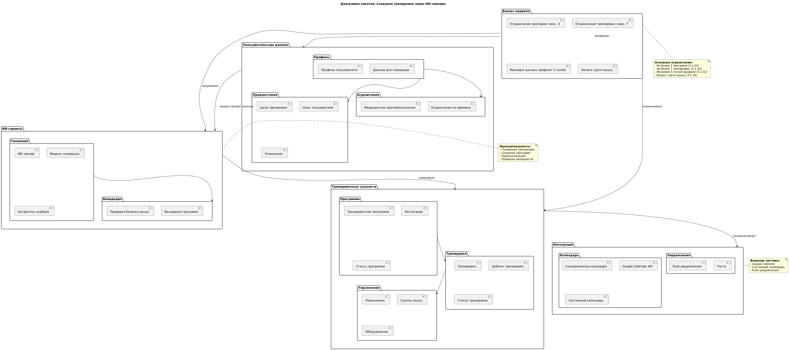
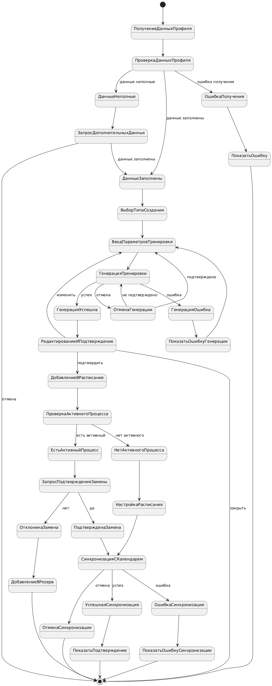
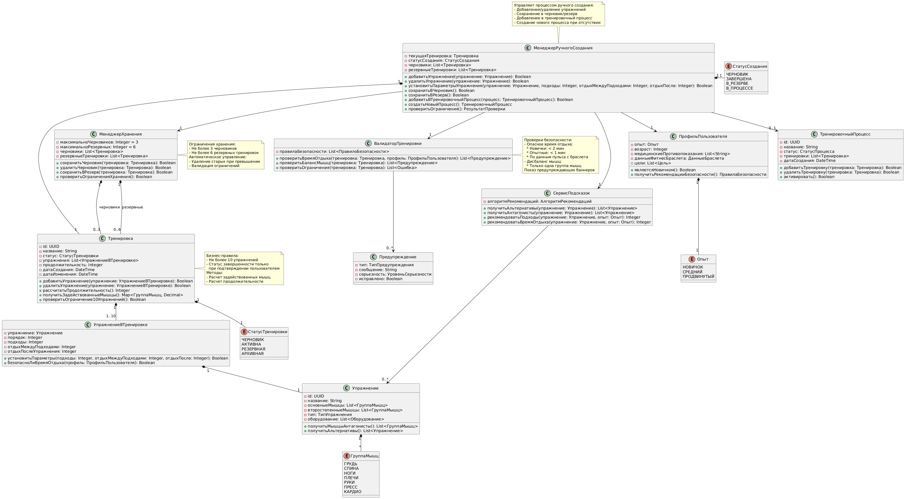
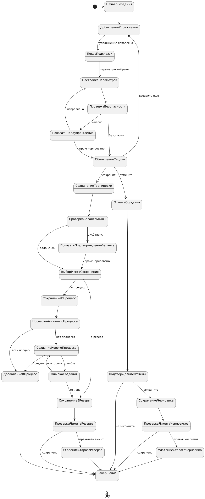
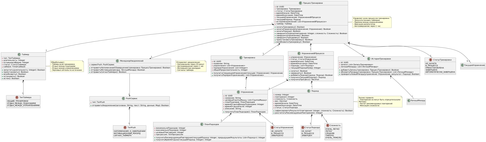

# Диаграммы UML

## Сценарий создания тренировки

Диаграмма использования

@drawio{https://github.com/Kataiii/system-engineering-playbook/blob/main/src/diagrams/usecase_create_training.drawio}

Диаграмма активности

@drawio{https://github.com/Kataiii/system-engineering-playbook/blob/main/src/diagrams/activity_create_training.drawio}

Диаграмма классов

Диаграмма пакетов

Диаграмма последовательности

Диаграмма состояний

## Сценарий редактирования тренировки

Диаграмма использования

@drawio{https://github.com/Kataiii/system-engineering-playbook/blob/main/src/diagrams/usecase_edit_training.drawio}

Диаграмма активности

@drawio{https://github.com/Kataiii/system-engineering-playbook/blob/main/src/diagrams/activity_edit_training.drawio}

Диаграмма классов

Диаграмма пакетов

Диаграмма последовательности

Диаграмма состояний

## Сценарий создания тренировки вручную

Диаграмма использования

@drawio{https://github.com/Kataiii/system-engineering-playbook/blob/main/src/diagrams/usecase_create_training.drawio}

Диаграмма активности

@drawio{https://github.com/Kataiii/system-engineering-playbook/blob/main/src/diagrams/activity_create_manual_training.drawio}

Диаграмма классов

Диаграмма пакетов

Диаграмма последовательности

Диаграмма состояний

## Сценарий процесса тренировка

Диаграмма использования

@drawio{https://github.com/Kataiii/system-engineering-playbook/blob/main/src/diagrams/usecase_training.drawio}

Диаграмма активности

@drawio{https://github.com/Kataiii/system-engineering-playbook/blob/main/src/diagrams/activity_training.drawio}

Диаграмма классов

Диаграмма пакетов

Диаграмма последовательности

Диаграмма состояний

